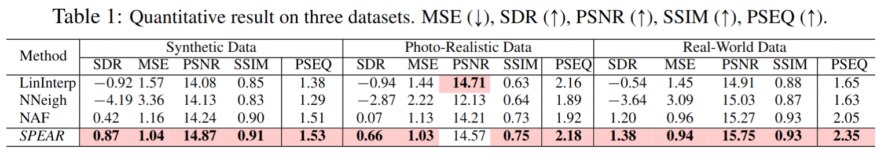
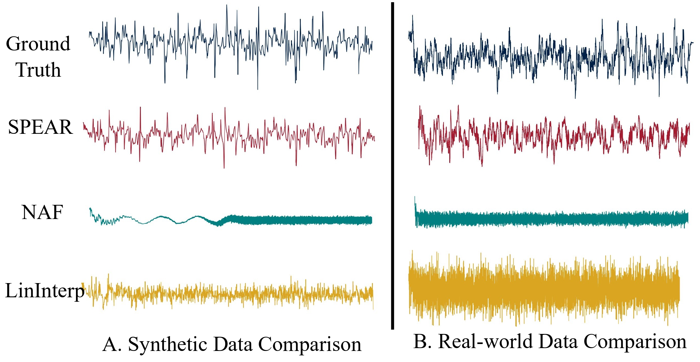

## SPEAR: Receiver-to-Receiver Acoustic Neural Warping Field

[Yuhang He](https://yuhanghe01.github.io/),
[Shitong Xu](https://github.com/xu-shitong),
[Jiaxing Zhong](https://www.cs.ox.ac.uk/people/jiaxing.zhong/),
[Sangyun Shin](https://www.cs.ox.ac.uk/people/sangyun.shin/),
[Niki Trigoni](https://www.cs.ox.ac.uk/people/niki.trigoni/),
[Andrew Markham](https://www.cs.ox.ac.uk/people/andrew.markham/)<br>
Department of Computer Science, University of Oxford. Oxford. UK.

**TL:DR**: a novel framework **SPEAR** for receiver-to-receiver spatial acoustic effects prediction. Contrary to traditonal methods that model spatial acoustic effects from source-to-receiver, **SPEAR** warps the spatial acoustic effects from one reference receiver to the target receiver.

<a href="todo"></a>
**SPEAR Motivation**: A stationary audio source is emitting audio in 3D space. Requiring neither source position nor 3D space acoustic properties, SPEAR simply requires two microphones to actively record the spatial audio independently at discrete positions. During training, SPEAR takes as input a pair of receiver positions and outputs a warping field potentially warping the recorded audio on reference position to target position. Minimizing the discrepancy between the warped audio and recorded audio enforces SPEAR to acoustically characterise the 3D space from receiver-to-receiver perspective. The learned SPEAR is capable of predicting spatial acoustic effects at arbitrary positions.

### Abstract 
We present *SPEAR*, a continuous receiver-to-receiver acoustic neural warping field for spatial acoustic effects prediction in an acoustic 3D space with a single stationary audio source. Unlike traditional source-to-receiver modelling methods that require prior space acoustic properties knowledge to rigorously model audio propagation from source to receiver, we propose to predict by warping the spatial acoustic effects from one reference receiver position to another target receiver position, so that the warped audio essentially accommodates all spatial acoustic effects belonging to the target position. *SPEAR* can be trained in a data much more readily accessible manner, in which we simply ask two robots to independently record spatial audio at different positions. We further theoretically prove the universal existence of the warping field if and only if one audio source presents. Three physical principles are incorporated to guide *SPEAR* network design, leading to the learned warping field physically meaningful. We demonstrate *SPEAR* superiority on both synthetic, photo-realistic and real-world dataset, showing the superiority of *SPEAR*.

Details of the model architecture and experimental results can be found in [our paper](todo).

### Challenge Presentation
</a>
Two challenges in SPEAR learning: **Position-Sensitivity** and **Irregularity**. The position-sensitivity is represented by much lower structural similarity index (SSIM) of two neighboring-step warping fields than the two RGB images (sub-fig.~C). The warping field irregularity is represented by both warping field visualization in frequency domain (real part) and much higher sample entropy score than regular sine wave (and just half of random waveform) (sub-fig. D).

### Main results
<p float="middle">
  
   
</p>

We qualitatively compare our model with three other baseline methods on 5 metrics, from which we can see that *SPEAR* outperforms all the three comparing methods by a large margin (except for one PSNR metric). 

We also provide qualitative comparison of the predicted warping field, in which we visualize the warping field (real-part) on a synthetic dataset (A) and real-world dataset (B) gnererated by all 4 methods. We can clearly observe that our *SPEAR* is more capable of generating the irregularity pattern from the input position pair than the other baseline models. 

### Result Reproduction

#### Step1: Create Envirionment
The experiment environment is given in file `environment.txt`. The code has been tested on Ubuntu 22.04.

#### Generate synthetic data
To generate the synthetic train and test data using Pyroomacoustic, run the following command

```python
python data/R2RGenerator.py train
python data/R2RGenerator.py test
```

#### Step 2: Train
To train a model, run 
```shell
python train.py config/Hyperparameter.yaml
```

#### Step 3: Test
To evaluate a model's test performance metric, uncomment corresponding lines in `test.py` and run the file. 
```shell
python test.py
```

#### Prtrained Models
We provide [trained SPEAR models](https://drive.google.com/drive/folders/1NGhwLEprhPiHWhrJbbYsSx9ne6frUZUe?usp=sharing) in 4 scenes: Synthetic Shoe Box Room, Office 0 and Office 4 in Replica dataset, and Classroom scene provided in Room Impulse Response Data Set.


### Generated examples
We provide examples of generated audios in an Office scene from the Replica dataset below. 

Engine sound
- Predicted <audio src="examples/office_0/engine/tgt_predicted.wav" controls preload></audio>Simulated (groud truth) <audio src="examples/office_0/engine/tgt.wav" controls preload></audio>

Human speech 1
- Predicted <audio src="examples/office_0/speech_2/tgt_predicted.wav" controls preload></audio>Simulated (groud truth) <audio src="examples/office_0/speech_2/tgt.wav" controls preload></audio>

Human speech 2
- Predicted <audio src="examples/office_0/speech_3/tgt_predicted.wav" controls preload></audio>Simulated (groud truth) <audio src="examples/office_0/speech_3/tgt.wav" controls preload></audio>


More examples of generated audios from different scenes could be found in the `examples` folder. 
- `examples/{scene_name}/{sound_source_name}/ref.wav`: simulated reference position audio
- `examples/{scene_name}/{sound_source_name}/tgt.wav`: simulated target position audio
- `examples/{scene_name}/{sound_source_name}/tgt_predicted.wav`: warped audio generated by the *SPEAR* model


### Citation

**Please CITE** our paper if you found this repository helpful for producing publishable results or incorporating it into other software.
```bibtext
todo
```

<!-- ## Acknowledgements :clap:
todo -->

### Contacts :email:
If you have any questions or suggestions, welcome to contact us (yuhang.he@cs.ox.ac.uk or shitong.xu@cs.ox.ac.uk).
